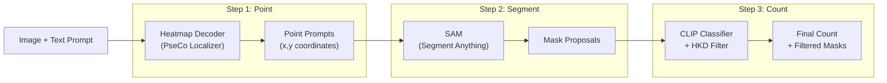

# PseCo Zero-Shot Counting & Segmentation -- Implementation Plan

## Goal

Build the 3-step pipeline described in the assignment: **Point -> Segment -> Count**, capable of taking an image + text prompt (e.g. "nhung qua tao") and outputting (1) a count and (2) per-object segmentation masks. Evaluate on FSC-147.

## Architecture Overview

## Phase 0: Environment and Data Setup

- Clone the official PseCo repo: `https://github.com/Hzzone/PseCo`
- Set up a Python environment (Python 3.10+, PyTorch, CUDA)
- Install dependencies: `segment-anything`, `open_clip_torch` (or `clip`), `torchvision`, `opencv-python`, `scipy`, etc.
- Download FSC-147 dataset (images + dot annotations) -- either from Hugging Face (`huggingface-cli download Hzzone/PseCo`) or from the official FSC-147 source
- Download pretrained weights: SAM ViT-H, CLIP ViT-B/16 (or ViT-L/14), PseCo localizer checkpoint

## Phase 1: Point -- Object Localization

- Implement or adapt PseCo's **heatmap decoder** that takes an image and produces a density/heatmap
- Apply **peak detection** (e.g. `scipy.ndimage` local maxima or non-maximum suppression) on the heatmap to extract `(x, y)` point coordinates
- These are the "point prompts" for SAM
- Key concern: balance between recall (not missing small/crowded objects) and precision (not generating too many spurious points)
- Reference: PseCo repo's localization module

## Phase 2: Segment -- SAM Mask Generation

- Load SAM (ViT-H recommended) using the `segment_anything` library
- For each point prompt from Phase 1, call `SamPredictor.predict()` with the point as input
- SAM returns multiple mask proposals per point (typically 3 at different granularities) -- collect all proposals
- Post-process: apply score thresholding and basic NMS to reduce redundant masks

## Phase 3: Count -- CLIP Classification + HKD Filtering

- **CLIP filtering**: For each mask proposal, crop/mask the region from the original image, encode it with CLIP's image encoder. Encode the user's text prompt with CLIP's text encoder. Compute **cosine similarity** -- keep masks above a threshold
- **Hierarchical Knowledge Distillation (HKD)**: This is PseCo's core contribution. Among the remaining masks, some may be hierarchically nested (e.g. "wheel" mask inside "car" mask). HKD trains a lightweight classifier to pick the correct granularity level. Implement or adapt from PseCo repo
- Final count = number of filtered masks that pass both CLIP and HKD checks

## Phase 4: Evaluation on FSC-147

- Implement evaluation metrics:
  - **MAE** = (1/N) * sum(|predicted_count - gt_count|)
  - **RMSE** = sqrt((1/N) * sum((predicted_count - gt_count)^2))
- Run inference on FSC-147 val/test split
- Report MAE and RMSE numbers
- Optionally visualize: overlay masks on input images, show count

## Phase 5: Demo / Inference Script

- Build a simple inference script: `python demo.py --image path/to/image.jpg --text "nhung qua tao"`
- Output: annotated image with masks drawn + printed count
- Optionally build a Gradio demo for interactive use

## Key Reference Repos

- **PseCo (primary)**: [github.com/Hzzone/PseCo](https://github.com/Hzzone/PseCo) -- the main codebase to adapt
- **CounTX**: [github.com/niki-amini-naieni/CounTX](https://github.com/niki-amini-naieni/CounTX) -- zero-shot counting reference
- **CLIP-Count**: [github.com/songrise/clip-count](https://github.com/songrise/clip-count) -- CLIP-based counting reference

## Hardware Requirements

- GPU with at least 12GB VRAM recommended (SAM ViT-H is large)
- Can use SAM ViT-B for lighter setup if GPU is limited
- CLIP ViT-B/16 is relatively lightweight
